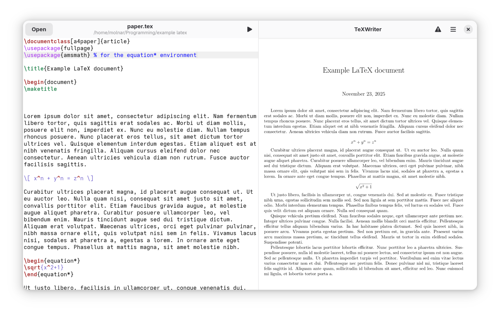
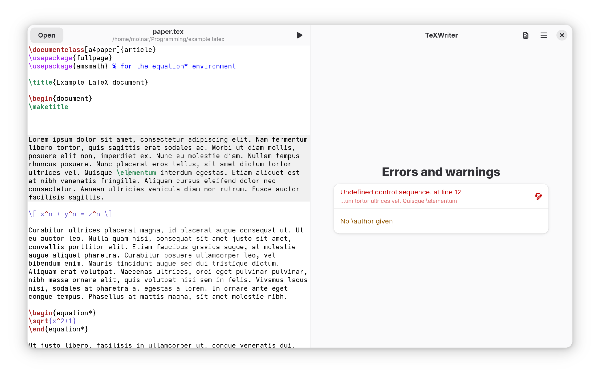

# TeX Writer

LaTeX editor for the Gnome desktop.

> [!WARNING] 
> The program is intended for private use only for now. Many important features are missing, the code is pretty badly written and I will anyway probably need to rewrite it either in Vala or Rust (if I manage to learn it).
> 
> Main reason: [there is a bug in PyGObject preventing the proper use of GtkSource completion.](https://gitlab.gnome.org/GNOME/pygobject/-/issues/581)
> 
> Also my pdf viewer has a memory leak somewhere...

## Installation

Don't try it. Really. 

If you want to try it despite the warnings, clone it and compile it with Gnome Builder. I think you need to install it for the file picker/compiler to work correctly (and for the app icon to show up). For that, click on "Export" in builder (in the drop-down menu next to the hammer icon), and then click on the flatpak package once the file viewer pops up. 

## Features

- Document editing
    * Open, edit and save files
    * Syntax highlighting
    * Basic command completion (in progress)
- Compilation
    * Auto save on compilation (press F5 or the play button for compiling)
    * Uses local LaTeX installation, and in particular, mklatex (you need to install it)
- Pdf viewing
    * Synctex back: double clicking on the pdf brings you to the source
    * Synctex forward: pressing F7 highlights the current position in the pdf
- Log viewing
    * Clicking on a line in the log viewer brings you back to the source where the error/warning occured (the icon indicates whether the line is clickable)

__Other planned features:__

- Better, context-aware completion: e.g., math suggestions show up only in math environment 
- WYSIWYG editing: 
	* diplay formulas directly in the editor
	* display images directly in the editor
	* suppress `\section` commands and display section title using large font 
	* suppress `\ref` commands and display reference, making them clickable
- maybe a quicker preview -- figure out how Apostrophe does its markdown preview
- Overleaf integration (?)
- Git integration (?)

## Design

TeXWriter is written using the [python bindings of Gtk](https://pygobject.gnome.org/index.html). Other libraries/tools used:

- [Libadwaita](https://gnome.pages.gitlab.gnome.org/libadwaita/)  -- GtK widgets that look cool.
- [GtkSource](https://gnome.pages.gitlab.gnome.org/gtksourceview/gtksourceview5/index.html) -- text editing capabilities, including code highlighting and command completion.
- [PyMupdf](https://pymupdf.readthedocs.io/en/latest/) -- for displaying the compiled pdf.
- [Blueprint](https://gnome.pages.gitlab.gnome.org/blueprint-compiler/) -- a markup language for easy UI definition

## Other screenshots

The pdf viewer automatically switches to the log viewer if the compilation fails. The log and error messages (mostly) are clickable.

